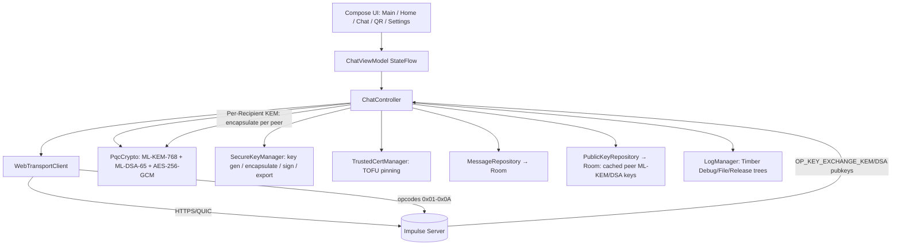
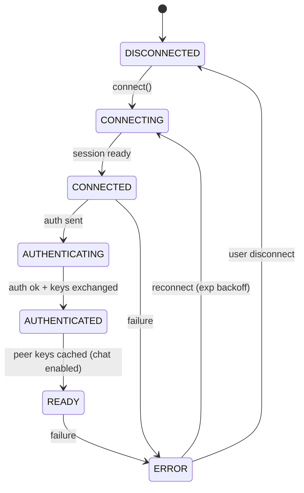

<div align="center">

[🇺🇸 **English**](README.md) | [🇷🇺 Русский](README.ru.md)


[](https://kotlinlang.org)
[](https://www.android.com)
[](LICENSE)
[](https://developer.android.com/reference/android/net/http/WebTransport)
[](https://en.wikipedia.org/wiki/ML-KEM)

Minimal, self-hosted, **post-quantum end-to-end-encrypted** LAN chat client for Android.
Pairs with the [Impulse server](https://github.com/Oqune/Impulse-server/).

</div>

## What changed in v2.0 (full rewrite)

The client was completely rewritten around a modern, quantum-resistant stack:

| Area | Old (removed) | New |
|------|---------------|-----|
| Transport | `WebSocket` (OkHttp, `wss://`) | **`WebTransport`** (Android `android.net.http`, API 33+, HTTPS/QUIC) |
| Wire format | newline-delimited JSON | **Binary protocol** (opcodes `0x01`–`0x08`, length-prefixed frames) |
| Server auth | trust-any self-signed cert | **Certificate pinning** via `serverCertificateHashes` (TOFU) |
| Key exchange | none / static key | **ML-KEM-768** (per-recipient KEM wrapping) + **ML-DSA-65** sender signatures |
| Group secret | KEM encapsulate | **Per-Recipient KEM** — each message encrypted N times (once per recipient) via ML-KEM-768 encapsulation |
| Message crypto | weak AES-ECB | **AES-256-GCM** with the per-recipient shared secret |
| Local store | plaintext `SharedPreferences` | **Room** (message bodies AES-256-GCM encrypted at the app layer, 72 h TTL) |
| Onboarding | manual URL + key | **QR-code scan** for the server cert hash |

## Features

- 🚀 **WebTransport** transport (Android 13+), replacing WebSocket entirely.
- 🔐 **Post-quantum E2EE**: Per-Recipient KEM Wrapping — each message is
  individually encrypted for every recipient using **ML-KEM-768** encapsulation.
  The sender generates a random shared secret per recipient, encrypts the message
  with **AES-256-GCM**, and sends all wrapped keys + ciphertexts in a single
  `OP_DATA` blob. Every message is signed with **ML-DSA-65 (Dilithium3)** — the
  NIST post-quantum signature standard — so receivers can authenticate the sender
  with PQ security.
- 📷 **TOFU certificate pinning** via QR scan (`impulse-cert:<sha256>`). The pinned
  hash is stored in an in-module encrypted store (`SecureStorage`, Android
  Keystore + AES-256-GCM); up to two hashes (current + next) are kept for
  seamless certificate rotation. The QR screen also offers a flashlight toggle
  and a manual hash entry fallback.
- 🗄️ **Encrypted local history** with Room. Each message body is encrypted
  with AES-256-GCM (see `PqcCrypto`) before it is written, so the
  `ciphertext` column never holds plaintext. Messages store
  `server_id`, `server_msg_id`, `sender`, `ciphertext`, `timestamp`.
  Automatic **72-hour TTL** cleanup runs on connect and every 6 hours via a
  `WorkManager` periodic worker (`TtlPurgeWorker`).
- 📱 Jetpack Compose (Material 3) UI with Fluent-style motion: chat list, input
  bar, QR scanner, settings, status indicators.
- 🔁 Automatic reconnect with exponential backoff; foreground service keeps the
  connection alive; boot receiver re-connects after reboot.
- 🔑 **Secure key export/import** — password-protected backup (PBKDF2 + AES-256-GCM)
  for transferring your ML-KEM identity across devices; a new ML-DSA key pair is
  generated on import for forward secrecy.
- 🌗 Light / Dark / System themes and optional biometric app lock.

## Binary protocol (opcodes `0x01`–`0x0A`)

Every frame starts with a single opcode byte. Field encoding is little-endian:
`u8` (1 B), `u32` (4 B length prefix), `u64` (8 B), `bytes`
(`u32` length + raw). The server never sees plaintext metadata — the sender,
signature and content live inside the AES-256-GCM `OP_DATA` payload.

| Opcode | Name | Direction | Body |
|--------|------|-----------|------|
| `0x01` | `OP_AUTH` | C→S | `sha256_hex(password)` (64-char lowercase hex utf8, length-prefixed) |
| `0x02` | `OP_AUTH_RESULT` | S→C | `success(u8)` [error utf8 if !success] |
| `0x03` | `OP_SYNC` | C→S | `last_seen_id(u64)` |
| `0x04` | `OP_SYNC_RESPONSE` | S→C | `count(u32)` { `id(u64)`, `timestamp(u64)`, `len(u32)`, `payload(bytes)` } |
| `0x05` | `OP_DATA` | both | C→S: `len(u32)`+`payload`. S→C relay: `server_msg_id(u64)`+`timestamp(u64)`+`len(u32)`+`payload` |
| `0x06` | `OP_HEARTBEAT` | both | `client_timestamp(u64)` |
| `0x07` | `OP_NEW_CERT_HASH` | S→C | `hash(32 bytes raw)` + `expiry(u64)` (no length prefix) |
| `0x08` | `OP_KEY_EXCHANGE` | both | `key_len(u32)`+`public_key` (ML-KEM-768, legacy) |
| `0x09` | `OP_KEY_EXCHANGE_KEM` | both | `key_len(u32)`+`ML-KEM-768 public key` (relayed to other clients) |
| `0x0A` | `OP_KEY_EXCHANGE_DSA` | both | `key_len(u32)`+`ML-DSA-65 public key` (relayed to other clients) |

The client sends `OP_DATA` as `len+payload`; the server prepends
`server_msg_id` + `timestamp` when it relays the message back to all peers. The
client stores the authoritative row keyed by the real (non-negative)
`server_msg_id`; its own optimistic copy uses a **negative** temp id so it can
never collide.

## Server setup & authentication

The server requires a password for client authentication. The password is **never
sent in plaintext** — the client computes `SHA-256(password)` as a lowercase hex
string and sends that hash in `OP_AUTH` (0x01).

### Generating the server password hash

```bash
# From the server directory
cargo run -- --hash-password "your-secret-password"
# Output: 64-character lowercase hex string
```

Copy the output and pass it to the server via `config.toml` or CLI:

```bash
# Via CLI flag
impulse-server --password-hash <64-char-hex>

# Or in config.toml
[server]
password_hash = "<64-char-hex>"
```

### Client configuration

In the app, go to **Settings → Server settings** and either:
- Select the built-in *Production* server and enter the same password you hashed
  on the server (built-in servers no longer ship with a default password for
  security), or
- Add a custom server with the correct IP, port, and password.

The client stores the **plaintext password** locally (in `ServerConfig`) and
computes the SHA-256 hex hash at connection time. If the server's stored hash
doesn't match, authentication is rejected with `OP_AUTH_RESULT` (0x02)
`success=0` and an error message.

### Common auth failure causes

| Symptom | Cause | Fix |
|---------|-------|-----|
| `Аутентификация отклонена сервером: Invalid password` | Client password doesn't match server hash | Ensure both sides use the same password; regenerate the server hash with `--hash-password` |
| Connection drops immediately after QR scan | Certificate hash mismatch | Re-scan the QR code or enter the hash manually |
| `Ошибка сессии WebTransport` | Server not reachable or not running | Check IP/port, ensure server is running, same network |
| Auth timeout (15 s) | Stream not established or firewall blocking QUIC | Verify UDP port 4433 is open, server supports HTTP/3 |

## Per-Recipient KEM Wrapping (replaces deterministic group key)

Each message is encrypted **N times** — once per recipient — using ML-KEM-768
encapsulation. The sender:

1. Builds and signs the inner envelope (`ML-DSA-65` signature over the payload).
2. For each cached peer ML-KEM public key, calls `encapsulateKem(recipientPubKey)`
   to generate a fresh `(encapsulatedKey, sharedSecret)`.
3. Encrypts the signed envelope with `AES-256-GCM(sharedSecret)` for that
   recipient.
4. Also encapsulates for **itself** (own public key) so it can decrypt its own
   message.
5. Serialises all `(recipientId, encKey, ciphertext)` triples into a single
   `OP_DATA` blob and sends it.

On receive, the client finds the triple whose `recipientId` matches its own
fingerprint (SHA-256 of ML-KEM public key, truncated to 32 hex chars), calls
`decapsulateKem(encKey)` with its private key, and decrypts with the recovered
shared secret. The server never decrypts — it only relays the opaque blob.

### Key generation & storage

- **`SecureKeyManager`** (singleton) generates and caches ML-KEM-768 and
  ML-DSA-65 key pairs. Keys are persisted in `SecureStorage` (Android Keystore +
  AES-256-GCM). On first run, both key pairs are generated; on subsequent runs,
  existing keys are loaded.
- **`PublicKeyRepository`** caches peers' ML-KEM and ML-DSA public keys in a
  Room database (`public_keys` table). Keys are indexed by `(serverId, fingerprint)`
  and auto-expire after **72 hours** (TTL sweep).

### Key exchange flow

After authentication, the client sends its ML-KEM public key via `OP_KEY_EXCHANGE_KEM`
(0x09) and its ML-DSA-65 public key via `OP_KEY_EXCHANGE_DSA` (0x0A). The server
relays these to all other clients, who cache them for Per-Recipient encryption.

### Export / Import

The ML-KEM private key can be exported as a password-protected binary backup
(PBKDF2 + AES-256-GCM) via **Settings → Export keys**. On import, the private
key is restored and a **new ML-DSA-65 key pair** is generated (the DSA key is
device-specific and never exported). The backup file is deleted after import.

## Requirements

- **Android 13 (API 33)** or newer device/emulator.
- Android Studio (AGP 8.13+), **JDK 17**, Android SDK 34+.
- A server that serves the **WebTransport** handshake over HTTPS/QUIC on the
  configured host:port (default `11000`) and speaks the binary protocol above
  (see [`transport/Protocol.kt`](app/src/main/java/com/example/impulse/transport/Protocol.kt)).

## Build & install

```bash
git clone https://github.com/Oqune/Impulse-client.git
cd Impulse-client
./gradlew assembleDebug        # or open in Android Studio and Run 'app'
```

Install the APK from `app/build/outputs/apk/debug/` onto a device/emulator
(API 33+). Camera permission is requested on first QR scan.

## First-run flow

1. Open the app → **Home** → tap **Подключиться** (Connect).
2. Because no certificate hash is trusted yet, the state becomes
   *"Ошибка / нужен QR"* (Error / QR needed).
 3. Go to the **QR** tab and scan the server's QR code (payload
    `impulse-cert:<hex-sha256-of-cert>`). The hash is pinned and the client
    immediately (re)connects. You can also tap the flashlight or enter the hash
    manually if scanning fails. **Strict validation:** only a payload that
    begins with the `impulse-cert:` prefix followed by exactly 64 hex characters
    is accepted — a bare 64-hex token is rejected to prevent pinning the wrong
    certificate.
 4. After a successful handshake the server may push a *next* cert hash
    (`OP_NEW_CERT_HASH`); it is stored as the second slot for rotation.
  5. ML-KEM-768 + ML-DSA-65 public keys are exchanged automatically via
     `OP_KEY_EXCHANGE_KEM` (0x09) and `OP_KEY_EXCHANGE_DSA` (0x0A); once all
     peer keys are cached, the channel becomes `READY` (chat enabled). The
     connection state machine is `CONNECTING → CONNECTED → AUTHENTICATING →
     AUTHENTICATED → READY`; sending is blocked until `READY`.
  6. **Authentication is automatic.** The moment the WebTransport session becomes
     `CONNECTED`, the client sends `OP_AUTH` (0x01) with the server password
     (UTF-8). If the server does not answer `OP_AUTH_RESULT` (0x02) within
     **15 s**, the client transitions to `ERROR` with a clear message instead of
     hanging in `CONNECTED`. (This auto-send was the root cause of the earlier
     "client never connects" bug — the session was opened but authentication was
     never transmitted.) On devices below **API 33** the client fails fast with a
     clear error, since `android.net.http.WebTransport` is unavailable there.
   6b. **Password is hashed before sending.** The `OP_AUTH` payload is
      `SHA-256(password)` as **lowercase hex** (the same value the server computes
      via `printf 'pw' | sha256sum`), never the raw password. Sending the raw
      password previously caused every auth to be rejected ("Wrong password
      hash"). The plaintext password is therefore never placed on the wire.
   6c. **AuthResult frame parsing fix.** The client's binary frame-length
      calculator (`Protocol.frameLength`) previously inverted the success/failure
      condition for `OP_AUTH_RESULT` (0x02) — the `success` byte 0x01 (success)
      was treated as carrying an error message, and 0x00 (failure) was treated
      as having no body. This caused successful auth responses to be truncated
      and lost, leaving the connection stuck in `AUTHENTICATING` until timeout.
      The condition is now corrected: `success != 0` → 2 bytes (no message),
      `success == 0` → has an error message body.
  7. **Connection diagnostics.** If a connect fails, the UI (Home + Server
     settings) now shows the *precise* reason instead of a generic "Ошибка":
     - *"Нет доверенного QR-хэша…"* — no cert pinned and DEV-pinning off → scan
       the QR or enable **DEV: отключить привязку сертификата** in Server settings.
     - *"Хост <ip>:<port> недоступен…"* — a 3 s `InetAddress.isReachable` probe
       failed → wrong IP/port or server not in the same network.
     - *"Ошибка сессии WebTransport (code=N)…"* — the QUIC/HTTP3 handshake failed
       (the server must speak WebTransport over HTTPS/QUIC, not plain WebSocket).
     - *"Аутентификация отклонена сервером: …"* — wrong password.

## Project layout

```
app/src/main/java/com/example/impulse/
├── MainActivity.kt                     # entry point, biometric lock, foreground service, TTL purge
├── ChatController.kt                   # orchestrates transport + crypto + storage + Per-Recipient KEM
├── transport/
│   ├── WebTransportClient.kt           # WebTransport session + serverCertificateHashes + reconnect
│   ├── Protocol.kt                     # binary wire protocol (opcodes 0x01–0x0A)
│   └── ConnectionState.kt
├── security/
│   ├── PqcCrypto.kt                    # ML-KEM-768 + ML-DSA-65 + AES-256-GCM + Per-Recipient KEM
│   ├── SecureKeyManager.kt             # key generation, encapsulate/decapsulate, sign/verify, export/import
│   ├── SecureStorage.kt                # Android Keystore + AES-256-GCM store (keys + cert hashes)
│   └── TrustedCertManager.kt           # TOFU, max-2-hash rotation
├── data/
│   ├── ServerConfig.kt                 # WebTransport URL builder (https://host:port)
│   ├── ServerPreferences.kt
│   ├── MessageRepository.kt            # Room access + 72h TTL purge
│   ├── PublicKeyRepository.kt          # high-level access to cached peer ML-KEM/ML-DSA public keys
│   └── db/                             # Room entities, DAO, database, repository
│       ├── PublicKeyEntity.kt          # Room entity for cached public keys
│       └── PublicKeyDao.kt             # Room DAO for public key CRUD + TTL sweep
├── service/
│   ├── WebTransportForegroundService.kt
│   ├── TtlPurgeWorker.kt               # periodic 72h TTL cleanup (WorkManager)
│   └── StartServiceWorker.kt           # boot-time expedited start
├── receiver/BootReceiver.kt
└── ui/
    ├── ChatViewModel.kt / ChatViewModelFactory.kt   # MVVM bridge (StateFlow<List<DecryptedMessage>>)
    ├── theme/                          # Material 3 theme
    └── screens/                        # MainScreen, HomeScreen, ChatScreen, QrScanScreen, Settings…
```

## Testing

```bash
./gradlew test            # unit tests: PqcCrypto (ML-KEM, ML-DSA-65, AES) + Protocol (opcodes) + SecureKeyManager + PerRecipientPacket
./gradlew connectedAndroidTest   # instrumented: TrustedCertManager (TOFU, max-2-hash) + MessageDao (Room, TTL)
```

Test coverage includes:
- `PqcCryptoTest` — ML-KEM keygen, AES-256-GCM round-trip, ML-KEM encapsulate/decapsulate,
  ML-DSA-65 sign/verify (incl. tamper & wrong-key rejection).
- `SecureKeyManagerTest` — key generation, encapsulate/decapsulate round-trip, ML-DSA sign/verify.
- `PerRecipientPacketTest` — Per-Recipient blob build/parse round-trip, multi-recipient
  encapsulation (different encKeys, same plaintext).
- `PublicKeyCacheTest` — Room entity equality, ByteArray key storage.
- `ProtocolTest` — all opcodes `0x01`–`0x0A` build/parse round-trips.
- `QrParseTest` — **strict** `impulse-cert:<64 hex>` validation (rejects bare 64-hex).
- `ChatControllerIntegrationTest` — full protocol cycle simulated without a network:
  two clients derive the same group secret, auth/key-exchange frames round-trip,
  `OP_DATA` carries the server-assigned id for dedup, optimistic send uses a
  negative temp id, and the `READY` state exists.
- `LogManagerRedactTest` — verifies defensive secret-redaction masks passwords,
  private keys, ciphertext and long hex runs in all log output.
- `MessageDaoTest` (instrumented) — upsert dedup (negative temp id → real id),
  ordered select, 72 h TTL purge, `maxServerMsgId`, per-server clear.

## Logging

Structured logging is provided by [`util/LogManager.kt`](app/src/main/java/com/example/impulse/util/LogManager.kt)
(a thin wrapper over [Timber](https://github.com/JakeWharton/timber)) with three
trees:

- **DebugTree** — full logcat output (debug builds only).
- **FileTree** — appends every record to a rotating file set on disk
  (max 5 MB per file, 5 files kept) so logs survive process death and can be
  exported from **Settings → Logs**.
- **ReleaseTree** — only `ERROR`/`ASSERT` to logcat in production (no file, no PII).

Log line format:

```
[2025-07-17T14:30:45.123] [INFO] [ChatController] Message sent, server_id=42
```

**Privacy:** passwords, private keys, full cert hashes and message contents are
never logged. Cert hashes are truncated to the first 8 hex chars via
`LogManager.shortHash`; secrets are replaced with `<redacted>` via
`LogManager.redact`. The in-app **Logs** screen (Settings → Logs) shows the last
 1000 records with a level filter (ALL / ERROR / WARN / INFO), export to a file,
 and clear. A global uncaught-exception handler
 ([`ImpulseApplication`](app/src/main/java/com/example/impulse/ImpulseApplication.kt))
 also writes a crash report to disk so "crashes without logs" are diagnosable.

 **Export & location.** The on-disk log directory is the app-specific path
 `<filesDir>/logs/` (e.g. `/data/data/com.example.impulse/files/logs/` on the
 device; no hardcoded absolute paths). When you tap **Экспортировать** (Export)
 the app writes a timestamped file (`impulse_logs_YYYYMMDD_HHMMSS.txt`) into that
 directory and immediately shows a **Toast with the exact absolute path** plus a
 **Snackbar** with a *Copy* action (copies the path to the clipboard). A
 **folder icon** button opens the log directory via a safe `FileProvider`
 `ACTION_VIEW` intent (authority `<applicationId>.fileprovider`, declared in
 `AndroidManifest.xml` + `res/xml/file_paths.xml`) — no `file://` URI is ever
 used, so it works on Android 7+ without `FileUriExposedException`. The same
 directory is where the rotating `FileTree` writes its 5 × 5 MB ring.

## Architecture



Connection state machine:



## Build notes / implementation details

- **Post-quantum crypto (ML-KEM-768) + ML-DSA-65 (Dilithium3).** Provided by
  BouncyCastle (`bcprov`/`bcpkix` 1.79). On Android's ART runtime the Kyber/ML-KEM
  algorithms are only reachable through the dedicated `BouncyCastlePQCProvider`
  (`Security.addProvider(BouncyCastlePQCProvider())`); the generic
  `BouncyCastleProvider` does **not** register them. Key generation uses
  `KeyPairGenerator.getInstance("Kyber")` with `KyberParameterSpec.kyber768`.
  ML-DSA-65 signing/verification uses `KeyFactory.getInstance("Dilithium")` via
  the same PQC provider. See
  [`security/PqcCrypto.kt`](app/src/main/java/com/example/impulse/security/PqcCrypto.kt)
  and [`security/SecureKeyManager.kt`](app/src/main/java/com/example/impulse/security/SecureKeyManager.kt).
- **Per-Recipient KEM Wrapping.** Each message is encrypted N times (once per
  recipient) using ML-KEM-768 encapsulation. The sender calls `encapsulateKem`
  for each cached peer public key to produce a fresh `(encapsulatedKey, sharedSecret)`
  pair, encrypts the signed envelope with AES-256-GCM using that shared secret,
  and sends all wrapped keys + ciphertexts in a single `OP_DATA` blob. The
  recipient calls `decapsulateKem` with its ML-KEM private key to recover the
  shared secret and decrypt. The server never decrypts — it only relays opaque
  bytes. Public keys are cached in Room (`PublicKeyEntity`) with a 72-hour TTL.
- **Secure storage.** Instead of AndroidX `EncryptedSharedPreferences`
  (which pulls in the Tink + Gson transitive dependencies), the app ships a
  self-contained [`security/SecureStorage.kt`](app/src/main/java/com/example/impulse/security/SecureStorage.kt)
  built directly on the Android `KeyStore` (`AndroidKeyStore`) and
  `AES/GCM/NoPadding`. The public API (`putString`/`getString`/`putBytes`/
  `getBytes`/`remove`/`contains`) is identical, so callers are unchanged.
- **WebTransport stubs.** The `android.net.http.*` (API 33+) symbols are
  provided at compile time by a local stub JAR (`app/libs/android-net-http-stub.jar`,
  `compileOnly`) because some SDK platform stubs do not ship these classes. The
  real implementation comes from the device framework at runtime.
- **Inner envelope JSON (no `org.json` dependency).** The `OP_DATA` inner
  envelope (`{"sender":…,"signature":…,"content":…}`) is encoded/decoded by a
  tiny hand-rolled JSON writer/reader in
  [`transport/Protocol.kt`](app/src/main/java/com/example/impulse/transport/Protocol.kt)
  rather than `org.json.JSONObject`. This removes the Android-framework JSON
  dependency so the same code path is exercised by JVM unit tests without
  Robolectric, and keeps the APK lean. The writer escapes `"`, `\`, control
  characters and emits `\uXXXX` for non-ASCII; the reader tolerantly extracts the
  three known string fields.
- **Unit-test friendliness.** `app/build.gradle.kts` sets
  `testOptions.unitTests.isReturnDefaultValues = true` so framework stubs return
  safe defaults in unit tests. The instrumented `androidTest` suite
  (`MessageDaoTest`, `TrustedCertManagerTest`) runs on-device via
  `AndroidJUnit4` (no Robolectric), since `TrustedCertManager` relies on the
  Android Keystore.
- **16 KB page-size (Android 15+) compatibility.** Android 15+ devices that use
  16 KB memory pages reject native libraries whose **ELF `PT_LOAD` segments**
  have `p_align < 16384` (`dlopen failed: ... has invalid alignment`). Note that
  `zipalign` only aligns the *zip entry offset*, NOT the ELF-internal `p_align`,
  so it cannot fix this by itself.
  - We **do not use SQLCipher** (its `libsqlcipher.so` is 4 KB ELF-aligned); the
    message store is plain Room and every message body is encrypted at the
    application layer with AES-256-GCM (see `PqcCrypto`) before being written.
  - The QR (TOFU) scanner uses the **standalone ML Kit Barcode library**
    (`com.google.mlkit:barcode-scanning:17.3.0`) for decoding, with the camera
    preview implemented directly on the framework **Camera2 API** (no CameraX
    dependency). This avoids bundling CameraX's unaligned native library
    `libimage_processing_util_jni.so` entirely. The standalone ML Kit library
    bundles `libbarhopper_v3.so` whose `PT_LOAD` segments are 4 KB aligned. To
    make the APK 16 KB compatible **without recompiling the third-party
    library**, the build runs a post-package step (`app/scripts/align16kb.py`,
    wired via the `align16kbDebug`/`align16kbRelease` Gradle tasks) that rewrites
    every `lib/*.so` inside the APK so each `PT_LOAD` segment gets
    `p_align = 16384` **and** a 16 KB-aligned `p_offset`/`p_vaddr` (the Android
    16 KB loader requires BOTH the file offset and the virtual address to be 16
    KB aligned, not just the declared `p_align`). The script re-lays-out the ELF
    with a zero bias (`p_offset == p_vaddr`, both 16 KB aligned) which is always
    a valid, loadable layout, then re-runs `zipalign -p 16` and finally **verifies**
    every `lib/*.so` is 16 KB aligned (the build fails if any is not). Verified:
    all remaining `.so` files report `ALL .so 16KB ALIGNED: True`.
  - The manifest also sets `android:extractNativeLibs="true"` together with
    `packaging.jniLibs.useLegacyPackaging = true` so the installer re-pages any
    extracted native libs at install time.

## License

MIT — see [LICENSE](LICENSE). Client and server are intended to be used together.
