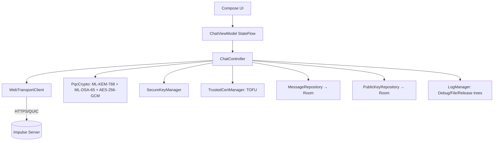

<div align="center">

[**English**](README.md) | [Русский](README.ru.md)


[](https://kotlinlang.org)
[](https://www.android.com)
[](LICENSE)
[](https://developer.android.com/reference/android/net/http/WebTransport)
[](https://en.wikipedia.org/wiki/ML-KEM)
[](https://github.com/Oqune/Impulse-client/releases)

Minimal, self-hosted, **post-quantum end-to-end-encrypted** LAN chat client for Android.
Pairs with the [Impulse server](https://github.com/Oqune/Impulse-server/).

</div>

## Features

- **WebTransport transport:** Android 9+ support, replacing WebSocket entirely with HTTP/3 datagrams and streams.
- **Post-quantum E2EE:** Per-Recipient KEM Wrapping — each message is individually encrypted for every recipient using **ML-KEM-768** encapsulation. The sender encrypts the message with **AES-256-GCM** and signs it with **ML-DSA-65 (Dilithium3)** so receivers authenticate the sender with PQ security.
- **TOFU certificate pinning:** QR scan (`impulse-cert:<sha256>`), stored in an encrypted `SecureStorage` (Android Keystore + AES-256-GCM); up to two hashes (current + next) are kept for seamless certificate rotation.
- **Encrypted local history:** Room DB where each message body is encrypted with AES-256-GCM before being written; automatic **72-hour TTL** cleanup.
- **Jetpack Compose (Material 3) UI:** Pure OLED dark mode, responsive layout, automatic reconnect with exponential backoff, foreground service, and boot-time reconnect.
- **Secure key export/import:** PBKDF2 + AES-256-GCM for moving your ML-KEM identity across devices, with a fresh ML-DSA key generated on import.
- **Interface & Security:** Light / Dark / System themes and optional biometric app lock.

## Binary protocol (opcodes `0x11`–`0x34`)

Every frame starts with a single opcode byte. Opcodes are domain-categorized:
high nibble = category (`0x1_` Auth, `0x2_` Session, `0x3_` Data & Relay), low nibble = action.
Field encoding is little-endian: `u8` (1 B), `u32` (4 B length prefix), `u64` (8 B), `bytes` (`u32` length + raw).
The server never sees plaintext metadata — sender, signature and content live
inside the AES-256-GCM `OP_DATA` payload.

| Opcode | Domain | Name | Direction | Body |
|--------|--------|------|-----------|------|
| `0x11` | Auth | `OP_AUTH_CHALLENGE` | S→C | `[16-byte nonce][u32 salt_len][B64 Argon2id salt][u32 params_len][params]` |
| `0x12` | Auth | `OP_AUTH` | C→S | `[u32 LE hmac_len=32][32 raw HMAC-SHA-256 proof bytes]` |
| `0x13` | Auth | `OP_AUTH_RESULT` | S→C | `success(u8)` [error utf8 if !success] |
| `0x21` | Session | `OP_HEARTBEAT` | both | `client_timestamp(u64)` |
| `0x22` | Session | `OP_NEW_CERT_HASH` | S→C | `hash(32 bytes raw)` + `expiry(u64)` (no length prefix) |
| `0x23` | Session | `OP_DISCONNECT` | both | no payload |
| `0x31` | Data | `OP_KEY_EXCHANGE_KEM_DSA` | both | `[u32 total_len][u32 kem_len][kem_pub][u32 dsa_len][dsa_pub][u32 sig_len][sig]` |
| `0x32` | Data | `OP_DATA` | both | C→S: `len(u32)`+`payload`. S→C relay: `server_msg_id(u64)`+`timestamp(u64)`+`len(u32)`+`payload` |
| `0x33` | Data | `OP_SYNC` | C→S | `last_seen_id(u64)` |
| `0x34` | Data | `OP_SYNC_RESPONSE` | S→C | `count(u32)` { `id(u64)`, `timestamp(u64)`, `len(u32)`, `payload(bytes)` } |

The authoritative list is defined in `transport/Protocol.kt` (`Op` object / `OP_*` constants) and the server's `src/protocol.rs` (`Opcode` enum) — they MUST stay in sync.

The client stores the authoritative row keyed by the real `server_msg_id`; its
own optimistic copy uses a **negative** temp id so it can never collide.

## Authentication

Challenge-response over Argon2id + HMAC-SHA-256. The server stores only an
Argon2id hash of the password (never the plaintext). Flow:

1. Server sends `OP_AUTH_CHALLENGE` (0x11): 16-byte nonce + Argon2id salt + OWASP parameters.
2. Client computes `key = Argon2id(salt, password)`, then `HMAC-SHA-256(key, nonce)`.
3. Client sends `OP_AUTH` (0x12) with `[u32 hmac_len=32][32 raw HMAC]` (no password on the wire).
4. Server verifies the HMAC and replies `OP_AUTH_RESULT` (0x13).

Generate the server password hash with `impulse-server --hash-password <pw>` and
pass it via `config.toml` (`password_hash`) or `--password-hash`.

In the app: **Settings → Server settings** → pick the built-in *Production*
server (enter the same password) or add a custom server (IP, port, password).

## Requirements & build

- **Android 9 (API 28)**+ device/emulator.
- Android Studio (AGP 8.13+), **JDK 17**, Android SDK 34+.
- A server speaking **WebTransport** over HTTPS/QUIC on the configured host:port.

```bash
git clone https://github.com/Oqune/Impulse-client.git
cd Impulse-client
./gradlew assembleDebug        # or open in Android Studio and Run 'app'
```

Install the APK from `app/build/outputs/apk/debug/` (API 28+). Camera permission
is requested on first QR scan. Signed release builds use the local
`keystore/impulse-release.jks` (see `docs/policies/release.md`).

## First-run

1. Open the app → **Home** → tap **Connect**.
2. With no pinned cert the state becomes *Error / QR needed*.
3. Go to the **QR** tab and scan the server's QR (`impulse-cert:<64-hex-sha256>`).
   Only a strict `impulse-cert:<64 hex>` payload is accepted.
4. The server may push a *next* cert hash (`OP_NEW_CERT_HASH`) for rotation.
5. ML-KEM-768 + ML-DSA-65 public keys are exchanged atomically via
   `OP_KEY_EXCHANGE_KEM_DSA` (0x31); once peer keys are cached the channel is `READY`.
6. **Authentication is automatic** on connect: the server sends `OP_AUTH_CHALLENGE` (0x11),
   the client replies with `OP_AUTH` (0x12), and on `OP_AUTH_RESULT` (0x13) within 15 s the
   channel becomes `AUTHENTICATED → READY`. Sending is blocked until `READY`.

## Implementation notes

- **PQC** (ML-KEM-768 + ML-DSA-65) comes from BouncyCastle
  (`bcprov-jdk18on`); on Android ART it is reachable only via the dedicated
  `BouncyCastlePQCProvider`. See `security/PqcCrypto.kt`.
- **Per-Recipient KEM Wrapping**: each message is encrypted N times (once per
  recipient) via ML-KEM-768; the server only relays opaque bytes. Peer public
  keys are cached in Room with a 72-hour TTL.
- **Secure storage** is a self-contained `SecureStorage.kt` on Android Keystore +
  AES-256-GCM (no Tink/Gson dependency).
- **WebTransport** symbols (`android.net.http.*`, API 28+) are provided at
  compile time by a local stub JAR (`app/libs/android-net-http-stub.jar`,
  `compileOnly`); the runtime implementation comes from the device framework.
- **16 KB page-size (Android 15+)**: the build rewrites bundled native `.so`
  files to 16 KB ELF alignment (`app/scripts/align16kb.py`) so the APK loads on
  Android 15+ devices. ABI `x86` is included for emulators; QUIC degrades there
  (no x86 native lib) by design.

## Architecture



Connection state machine: `DISCONNECTED → CONNECTING → CONNECTED →
AUTHENTICATING → AUTHENTICATED → READY`; failures go to `ERROR` with auto-reconnect.

## Testing

```bash
./gradlew test            # unit: PqcCrypto, Protocol, SecureKeyManager, PerRecipientPacket
./gradlew connectedAndroidTest   # instrumented: TrustedCertManager (TOFU), MessageDao (Room, TTL)
```

Coverage includes ML-KEM/ML-DSA round-trips, tamper rejection, TOFU pinning,
Per-Recipient blob build/parse, and a full protocol cycle simulated without a network.

## License

MIT — see [LICENSE](LICENSE). Client and server are intended to be used together.
