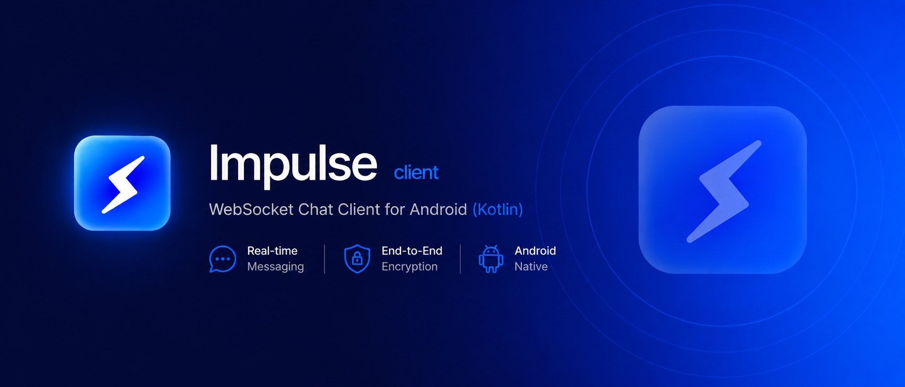

<div align="center">

[🇬🇧 **English**](README.md) | [🇷🇺 Русский](README.ru.md) | [🇨🇳 中文](README.zh.md)



[](https://kotlinlang.org)
[](https://www.android.com)
[](LICENSE)
[](https://square.github.io/okhttp/)

Minimal, self-hosted, end-to-end-encrypted LAN chat client for Android. Pairs with the [Impulse server](https://github.com/Oqune/Impulse-server/).

</div>

## Features

- 🔌 Persistent WebSocket connection with automatic reconnect (exponential backoff).
- 🛡️ Optional per-server message encryption (AES, key exchanged in-app).
- 📱 Native Android UI built with Jetpack Compose (Material 3).
- 🌗 Light / Dark / System theme support.
- 🔒 Optional biometric lock to open the app (fingerprint / face) via Android BiometricPrompt.
- 🗂️ Per-server isolated chat history.
- 💬 Clean bubble-style conversation — your own messages are de-duplicated when the server echoes them back, and system / join / leave / error events never clutter the chat.
- ⌨️ Soft-keyboard handling tuned so the input bar never covers your messages.

## Build & run

Requirements: Android Studio (AGP 8.13+), JDK 17, Android SDK 34+.

```bash
git clone https://github.com/Oqune/Impulse-client.git
cd Impulse-client
./gradlew assembleDebug        # or open in Android Studio and Run 'app'
```

Install the APK from `app/build/outputs/apk/debug/` onto a device or emulator.

## Configuration

1. Open the app and go to **Servers** → add your server URL (e.g. `wss://192.168.1.50:8443`).
2. (Optional) Set an encryption key shared with the server.
3. Pick a display name and start chatting.

> The Impulse server listens **only** on a secure `wss://` endpoint (TLS is mandatory). For a self-signed LAN certificate, the client trusts the server's cert and skips hostname verification — acceptable for a self-hosted LAN where you control both ends.

## Project layout

```
app/src/main/java/com/example/impulse/
├── MainActivity.kt
├── websocket/WebSocketManager.kt        # single WebSocket singleton + reconnect
├── service/WebSocketForegroundService.kt # keeps the socket alive in background
├── ui/screens/ChatScreen.kt           # chat UI + ChatHistoryManager
├── ui/screens/*.kt                    # Home, Settings, Server, User, Biometric…
├── data/                              # ServerConfig, preferences
├── encryption/MessageEncryption.kt    # AES helpers
└── util/                              # NameGenerator, LogStorage, BiometricHelper
```

## License

MIT — see [LICENSE](LICENSE). Client and server are intended to be used together.
