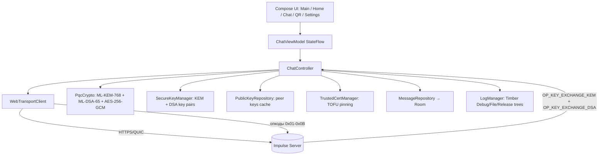
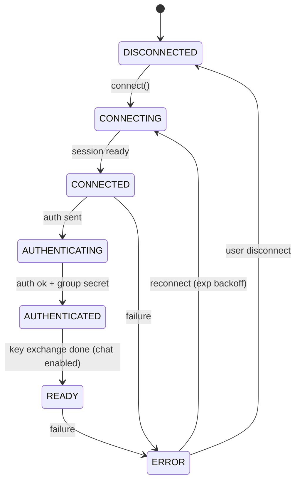

<div align="center">

[🇺🇸 **English**](README.md) | [🇷🇺 Русский](README.ru.md)


[](https://kotlinlang.org)
[](https://www.android.com)
[](LICENSE)
[](https://developer.android.com/reference/android/net/http/WebTransport)
[](https://en.wikipedia.org/wiki/ML-KEM)
[](https://github.com/Oqune/Impulse-client/releases)

Минимальный, самостоятельно развёртываемый, **постквантовый сквозь-шифрованный** LAN-клиент чата для Android.
Работает в паре с [сервером Impulse](https://github.com/Oqune/Impulse-server/).

</div>

## Возможности

- 🚀 **WebTransport**-транспорт (Android 9+), полностью заменяющий WebSocket.
- 🔐 **Постквантовое E2EE**: ML-KEM-768 для обмена ключами, ML-DSA-65 для подписи
  сообщений, шифрование AES-256-GCM. Каждое сообщение зашифровано на каждого
  получателя отдельно (per-recipient KEM).
- 📷 **Привязка сертификата (TOFU)** через QR-скан (`impulse-cert:<sha256>`). Хеш
  сохраняется в зашифрованном хранилище (`SecureStorage`, Android Keystore + AES-256-GCM);
  хранятся до двух хешей (текущий + следующий) для плавной ротации сертификата.
- 🗄️ **Зашифрованная история** на Room. Каждое тело сообщения шифруется
  AES-256-GCM (см. `PqcCrypto`) перед записью, поэтому столбец `ciphertext`
  никогда не содержит plaintext. Автоматическая очистка по **TTL 72 часа**.
- 📱 Jetpack Compose (Material 3) UI: список чата, строка ввода,
  сканер QR, настройки, индикаторы статуса.
- 🔁 Автоматическое переподключение с экспоненциальной задержкой; foreground-сервис
  держит соединение живым; receiver переподключает после перезагрузки.
- 🌗 Светлая / тёмная / системная темы и опциональная биометрическая блокировка.

## Бинарный протокол (опкоды `0x01`–`0x0C`)

Каждый кадр начинается с одного байта опкода. Кодирование полей little-endian:
`u8` (1 Б), `u32` (4 Б префикс длины), `u64` (8 Б), `bytes`
(`u32` длина + raw). Сервер никогда не видит метаданные plaintext — отправитель,
подпись и содержимое живут внутри AES-256-GCM `OP_DATA` payload.

| Опкод | Имя | Направление | Тело |
|-------|-----|-------------|------|
| `0x01` | `OP_AUTH` | C→S | `[u32 LE pwd_len][raw pwd bytes][32 raw HMAC bytes]` |
| `0x02` | `OP_AUTH_RESULT` | S→C | `success(u8)` [error utf8 если !success] |
| `0x03` | `OP_SYNC` | C→S | `last_seen_id(u64)` |
| `0x04` | `OP_SYNC_RESPONSE` | S→C | `count(u32)` { `id(u64)`, `timestamp(u64)`, `len(u32)`, `payload(bytes)` } |
| `0x05` | `OP_DATA` | both | C→S: `len(u32)`+`payload`. S→C relay: `server_msg_id(u64)`+`timestamp(u64)`+`len(u32)`+`payload` |
| `0x06` | `OP_HEARTBEAT` | both | `client_timestamp(u64)` |
| `0x07` | `OP_NEW_CERT_HASH` | S→C | `hash(32 байта raw)` + `expiry(u64)` (без префикса длины) |
| `0x0B` | `OP_AUTH_CHALLENGE` | S→C | `[16-byte nonce][u32 salt_len][B64 Argon2id salt]` |
| `0x0C` | `OP_KEY_EXCHANGE_KEM_DSA` | обе | `kem_key_len(u32)`+`ML-KEM-768 публичный ключ` + `dsa_key_len(u32)`+`ML-DSA-65 публичный ключ` (комбинированный, ретранслируется атомарно) |

Клиент отправляет `OP_DATA` как `len+payload`; сервер добавляет
`server_msg_id` + `timestamp` при ретрансляции сообщения всем пирам. Клиент
хранит авторитетную строку по реальному (неотрицательному) `server_msg_id`;
собственная оптимистичная копия использует **отрицательный** временный id,
чтобы никогда не collide.

## Групповой секрет (per-recipient KEM)

Каждое сообщение шифруется N раз — один раз на каждого получателя.
Отправитель генерирует случайный 32-байтовый shared secret для каждого
получателя, инкапсулирует его через ML-KEM-768, шифрует сообщение AES-256-GCM
этим секретом и отправляет все обёрнутые ключи + шифротекст в одном `OP_DATA`.
Подпись сообщения выполняется ML-DSA-65. Сервер ретранслирует комбинированный
`OP_KEY_EXCHANGE_KEM_DSA` (0x0C) паблики пирам атомарно — оба ключа в одном кадре,
что исключает гонки между разными каналами доставки.

## Настройка сервера и аутентификация

Сервер требует пароль для аутентификации клиентов. Аутентификация работает
по challenge-response протоколу:

1. Клиент подключается и получает `OP_AUTH_CHALLENGE` (0x0B) от сервера,
   содержащий 16-байтовый nonce и B64-закодированный Argon2id salt.
2. Клиент вычисляет ключ через Argon2id(salt, password).
3. Вычисляет HMAC-SHA-256(derived_key, nonce).
4. Отправляет `OP_AUTH` (0x01): `[u32 LE pwd_len][raw pwd bytes][32 raw HMAC]`.

Пароль **никогда не отправляется в открытом виде** — передаётся только raw
байты пароля для вычисления HMAC на стороне сервера.

### Генерация хеша пароля сервера

```bash
# Из директории сервера
cargo run -- --hash-password "your-secret-password"
# Вывод: B64-закодированный Argon2id salt
```

Скопируйте вывод и передайте серверу через `config.toml` или CLI:

```bash
# Через CLI флаг
impulse-server --password-hash <Argon2id-salt>

# Или в config.toml
[server]
password_hash = "<Argon2id-salt>"
```

### Настройка клиента

В приложении перейдите в **Настройки → Настройки сервера** и либо:
- Выберите встроенный сервер *Production* и введите тот же пароль, который
  хешировали на сервере, либо
- Добавьте кастомный сервер с правильным IP, портом и паролем.

Клиент хранит **plaintext пароль** локально (в `ServerConfig`). При подключении
сервер отправляет `OP_AUTH_CHALLENGE` (0x0B) с nonce и Argon2id salt.
Клиент вычисляет derived key через Argon2id, HMAC-SHA-256 и отправляет `OP_AUTH`.
Если HMAC не совпадает, аутентификация отклоняется с `OP_AUTH_RESULT` (0x02)
`success=0` и сообщением об ошибке.

### Частые причины ошибок аутентификации

| Симптом | Причина | Исправление |
|---------|---------|-------------|
| `Аутентификация отклонена сервером: Invalid password` | HMAC не совпадает — пароль неверный или salt устарел | Убедитесь, что обе стороны используют одинаковый пароль; перегенерируйте хеш сервера через `--hash-password` |
| Соединение разрывается сразу после сканирования QR | Несовпадение хеша сертификата | Пересканируйте QR-код или введите хеш вручную |
| `Ошибка сессии WebTransport` | Сервер недоступен или не запущен | Проверьте IP/порт, убедитесь что сервер запущен, обе стороны в одной сети |
| Таймаут аутентификации (15 с) | Поток не установлен или firewall блокирует QUIC | Убедитесь что UDP порт 4433 открыт, сервер поддерживает HTTP/3 |

## Требования

- **Android 9 (API 28)** или новее (устройство/эмулятор).
- Android Studio (AGP 8.13+), **JDK 17**, Android SDK 34+.
- Сервер, отдающий **WebTransport** handshake по HTTPS/QUIC на
  настроенном host:port (по умолчанию `4433`). Сервер speaks бинарный протокол
  выше (см. [`transport/Protocol.kt`](app/src/main/java/com/example/impulse/transport/Protocol.kt)).

## Сборка и установка

```bash
git clone https://github.com/Oqune/Impulse-client.git
cd Impulse-client
./gradlew assembleDebug        # или откройте в Android Studio и запустите 'app'
```

Установите APK из `app/build/outputs/apk/debug/` на устройство/эмулятор
(API 28+). Разрешение камеры запрашивается при первом сканировании QR.

## Первый запуск

1. Откройте приложение → **Главная** → нажмите **Подключиться**.
2. Так как хеш сертификата ещё не доверен, состояние станет
   *«Ошибка / нужен QR»*.
3. Перейдите на вкладку **QR** и отсканируйте QR-код сервера (формат
   `impulse-cert:<hex-sha256-сертификата>`). Хеш привязывается, и клиент
   сразу переподключается. Можно также включить фонарик или ввести хеш
   вручную, если сканирование не удаётся. **Строгая валидация:** принимается
   только payload начинающийся с `impulse-cert:` и ровно 64 hex символов после —
   голый 64-hex токен отклоняется, чтобы не привязать не тот сертификат.
4. После успешного handshake сервер может прислать *следующий* хеш
   (`OP_NEW_CERT_HASH`); он сохраняется как второй слот для ротации.
  5. Публичные ключи ML-KEM-768 + ML-DSA-65 обмениваются атомарно через
   `OP_KEY_EXCHANGE_KEM_DSA` (0x0C) — оба ключа в одном кадре; состояние становится
   `READY` (машина состояний: `CONNECTING → CONNECTED → AUTHENTICATING →
   AUTHENTICATED → READY`; отправка блокируется до `READY`).
6. **Аутентификация автоматическая.** В момент когда сессия WebTransport
   становится `CONNECTED`, сервер отправляет `OP_AUTH_CHALLENGE` (0x0B) с nonce
   и Argon2id salt. Клиент вычисляет HMAC-SHA-256 и отправляет `OP_AUTH` (0x01).
   Если сервер не отвечает `OP_AUTH_RESULT` (0x02) в течение **15 с**,
   клиент переходит в `ERROR` с понятным сообщением вместо зависания в
   `CONNECTED`. На устройствах ниже **API 28** клиент быстро завершается
   с ошибкой, так как `android.net.http.WebTransport` недоступен.
7. **Диагностика подключения.** Если подключение не удаётся, UI (Главная +
   Настройки сервера) показывает *точную* причину вместо generic "Ошибка":
   - *"Нет доверенного QR-хэша…"* — нет привязанного сертификата → отсканируйте
     QR или включите **DEV: отключить привязку сертификата** в настройках сервера.
   - *"Хост <ip>:<port> недоступен…"* — 3-секундный `InetAddress.isReachable`
     probe не прошёл → неверный IP/порт или сервер не в той же сети.
   - *"Ошибка сессии WebTransport (code=N)…"* — QUIC/HTTP3 handshake не удался
     (сервер должен говорить WebTransport по HTTPS/QUIC, не plain WebSocket).
   - *"Аутентификация отклонена сервером: …"* — неверный пароль.

## Структура проекта

```
app/src/main/java/com/example/impulse/
├── MainActivity.kt                     # точка входа, биометрия, foreground-сервис, TTL purge
├── ChatController.kt                   # оркестрация транспорта + крипты + хранилища + обмена ключами
├── transport/
│   ├── WebTransportClient.kt           # сессия WebTransport + serverCertificateHashes + переподключение
│   ├── Protocol.kt                     # бинарный протокол (опкоды 0x01–0x0B)
│   └── ConnectionState.kt
├── security/
│   ├── PqcCrypto.kt                    # ML-KEM-768 + ML-DSA-65 + AES-256-GCM + per-recipient KEM
│   ├── SecureKeyManager.kt             # Генерация и кэширование ML-KEM-768 + ML-DSA-65 ключей
│   ├── SecureStorage.kt                # Android Keystore + AES-256-GCM store (ключи + хеши сертификатов)
│   └── TrustedCertManager.kt           # TOFU, ротация до 2 хешей
├── data/
│   ├── ServerConfig.kt                 # WebTransport URL builder (https://host:port)
│   ├── ServerPreferences.kt
│   ├── MessageRepository.kt            # Room доступ + 72ч TTL purge
│   ├── PublicKeyRepository.kt          # Кэш пабликов ML-KEM + ML-DSA с 72ч TTL
│   └── db/                             # Room сущности, DAO, база, репозиторий
├── service/
│   ├── WebTransportForegroundService.kt
│   ├── TtlPurgeWorker.kt               # периодическая 72ч TTL очистка (WorkManager)
│   └── StartServiceWorker.kt           # expedited старт после boot
├── receiver/BootReceiver.kt
└── ui/
    ├── ChatViewModel.kt / ChatViewModelFactory.kt   # MVVM мост (StateFlow<List<DecryptedMessage>>)
    ├── theme/                          # Material 3 тема
    └── screens/                        # MainScreen, HomeScreen, ChatScreen, QrScanScreen, Settings…
```

## Тестирование

```bash
./gradlew test            # юнит-тесты: PqcCrypto (ML-KEM, ML-DSA-65, AES, per-recipient KEM) + Protocol (опкоды)
./gradlew connectedAndroidTest   # инструментальные: TrustedCertManager (TOFU, max-2-hash) + MessageDao (Room, TTL)
```

Покрытие тестами включает:
- `PqcCryptoTest` — генерация ML-KEM ключей, ML-DSA-65 sign/verify, AES-256-GCM round-trip,
  per-recipient KEM (инкапсуляция/деинкапсуляция на каждого получателя).
- `ProtocolTest` — все опкоды `0x01`–`0x0B` build/parse round-trips.
- `QrParseTest` — **строгая** валидация `impulse-cert:<64 hex>` (отклоняет голый 64-hex).
- `ChatControllerIntegrationTest` — полный протокольный цикл без сети:
  два клиента вычисляют один групповой секрет, auth/key-exchange кадры round-trip,
  `OP_DATA` несёт server-assigned id для дедупа, оптимистичная отправка использует
  отрицательный temp id, состояние `READY` существует.
- `MessageDaoTest` (инструментальный) — upsert дедуп (отрицательный temp id → реальный id),
  упорядоченный select, 72ч TTL purge, `maxServerMsgId`, per-server clear.

## Логирование

Структурированное логирование через [`util/LogManager.kt`](app/src/main/java/com/example/impulse/util/LogManager.kt)
(обёртка над [Timber](https://github.com/JakeWharton/timber)) с тремя деревьями:

- **DebugTree** — полный вывод в logcat (только debug-сборки).
- **FileTree** — добавляет каждую запись в ротируемый набор файлов на диске
  (макс. 5 МБ на файл, 5 файлов хранятся), поэтому логи survive процесс death
  и могут быть экспортированы из **Настройки → Логи**.
- **ReleaseTree** — только `ERROR`/`ASSERT` в logcat в production (нет файла, нет PII).

Формат строки лога:

```
[2025-07-17T14:30:45.123] [INFO] [ChatController] Message sent, server_id=42
```

**Конфиденциальность:** пароли, приватные ключи, полные хеши сертификатов и
содержимое сообщений никогда не логируются. Хеши сертификатов усекаются до
первых 8 hex символов через `LogManager.shortHash`; секреты заменяются на
`<redacted>` через `LogManager.redact`. В приложении **Логи** (Настройки → Логи)
показываются последние 1000 записей с фильтром по уровню (ALL / ERROR / WARN / INFO),
экспорт в файл и очистка. Глобальный обработчик неотловленных исключений
([`ImpulseApplication`](app/src/main/java/com/example/impulse/ImpulseApplication.kt))
также пишет crash-отчёт на диск, поэтому "креши без логов" диагностируемы.

## Архитектура



Машина состояний соединения:



## Заметки по сборке / детали реализации

- **Постквантовая крипта (ML-KEM-768) + ML-DSA-65.** Предоставляется BouncyCastle
  (`bcprov-jdk18on`/`bcpqc-jdk18on` 1.79). На ART runtime Android алгоритмы ML-KEM/ML-DSA
  доступны только через выделенный `BouncyCastlePQCProvider`
  (`Security.addProvider(BouncyCastlePQCProvider())`); общий
  `BouncyCastleProvider` их **не** регистрирует. Генерация ключей использует
  `KeyPairGenerator.getInstance("ML-KEM-768")` и `KeyPairGenerator.getInstance("ML-DSA-65")`.
  См. [`security/PqcCrypto.kt`](app/src/main/java/com/example/impulse/security/PqcCrypto.kt).
- **Per-recipient KEM.** Каждое сообщение шифруется N раз (на каждого получателя)
  через ML-KEM-768 инкапсуляцию. Отправитель генерирует случайный shared secret
  для каждого получателя, шифрует AES-256-GCM, подписывает ML-DSA-65. Все
  обёрнутые ключи + шифротекст отправляются в одном `OP_DATA` blob.
  См. [`security/PqcCrypto.kt`](app/src/main/java/com/example/impulse/security/PqcCrypto.kt).
- **Безопасное хранилище.** Вместо AndroidX `EncryptedSharedPreferences`
  (который тянет Tink + Gson transitive зависимости), приложение поставляет
  самодостаточный [`security/SecureStorage.kt`](app/src/main/java/com/example/impulse/security/SecureStorage.kt)
  построенный напрямую на Android `KeyStore` (`AndroidKeyStore`) и
  `AES/GCM/NoPadding`. Публичный API (`putString`/`getString`/`putBytes`/
  `getBytes`/`remove`/`contains`) идентичен, поэтому вызыватели не меняются.
- **WebTransport заглушки.** Символы `android.net.http.*` (API 28+) предоставляются
  на этапе компиляции локальным stub JAR (`app/libs/android-net-http-stub.jar`,
  `compileOnly`), потому что некоторые SDK platform stubs не содержат эти классы.
  Реальная реализация поступает из framework устройства во время выполнения.
- **Внутренний JSON конверт (без `org.json` зависимости).** Внутренний конверт
  `OP_DATA` (`{"sender":…,"signature":…,"content":…}`) кодируется/декодируется
  компактным hand-rolled JSON writer/reader в
  [`transport/Protocol.kt`](app/src/main/java/com/example/impulse/transport/Protocol.kt)
  вместо `org.json.JSONObject`. Это убирает Android-framework JSON зависимость,
  поэтому тот же код path тестируется JVM unit-тестами без Robolectric, и APK
  остаётся лёгким. Writer экранирует `"`, `\`, управляющие символы и emits
  `\uXXXX` для non-ASCII; reader толерантно извлекает три известных строковых поля.
- **Дружественность к unit-тестам.** `app/build.gradle.kts` устанавливает
  `testOptions.unitTests.isReturnDefaultValues = true`, поэтому framework stubs
  возвращают безопасные дефолты в unit-тестах. Инструментальный `androidTest` набор
  (`MessageDaoTest`, `TrustedCertManagerTest`) запускается на устройстве через
  `AndroidJUnit4` (без Robolectric), так как `TrustedCertManager` полагается на
  Android Keystore.
- **Совместимость с 16 КБ страницами (Android 15+).** Устройства Android 15+,
  использующие 16 КБ страницы памяти, отклоняют нативные библиотеки, чьи **ELF
  `PT_LOAD` сегменты** имеют `p_align < 16384` (`dlopen failed: ... has invalid
  alignment`). Обратите внимание, что `zipalign` выравнивает только *zip entry
  offset*, НЕ внутренний ELF `p_align`, поэтому он не может исправить это сам.
  - Мы **не используем SQLCipher** (его `libsqlcipher.so` имеет 4 КБ ELF-выравнивание);
  хранилище сообщений — plain Room, и каждое тело сообщения шифруется на уровне
  приложения AES-256-GCM (см. `PqcCrypto`) перед записью.
  - QR (TOFU) сканер использует **standalone ML Kit Barcode library**
  (`com.google.mlkit:barcode-scanning:17.3.0`) для декодирования, с превью камеры
  реализованным напрямую на framework **Camera2 API** (без CameraX зависимости).
  Это позволяет избежать bundling невыравненной нативной библиотеки CameraX
  `libimage_processing_util_jni.so`. Standalone ML Kit library bundling
  `libbarhopper_v3.so` имеет `PT_LOAD` сегменты с 4 КБ выравниванием. Чтобы
  сделать APK 16 КБ совместимым **без перекомпиляции третьесторонней
  библиотеки**, сборка запускает post-package шаг (`app/scripts/align16kb.py`,
  подключённый через Gradle задачи `align16kbDebug`/`align16kbRelease`), который
  перезаписывает каждый `lib/*.so` внутри APK так, чтобы каждый `PT_LOAD` сегмент
  получил `p_align = 16384` **и** 16 КБ-выравненный `p_offset`/`p_vaddr` (Android
  16 КБ loader требует ЧТОБЫ и file offset, и virtual address были 16 КБ
  выравнены, не только декларируемый `p_align`). Скрипт пере-размещает ELF
  с нулевым смещением (`p_offset == p_vaddr`, оба 16 КБ выровнены), что всегда
  является валидным, загружаемым layout, затем повторно запускает `zipalign -p 16`
  и наконец **верифицирует** каждый `lib/*.so` на 16 КБ выравнивание (сборка
  падает, если какой-то не выровнен). Проверено: все оставшиеся `.so` файлы
  report `ALL .so 16KB ALIGNED: True`.
  - Манифест также устанавливает `android:extractNativeLibs="true"` вместе с
  `packaging.jniLibs.useLegacyPackaging = true`, поэтому installer пере-странивает
  любые извлечённые нативные либы во время установки.

## Лицензия

MIT — см. [LICENSE](LICENSE). Клиент и сервер предназначены для совместного использования.
