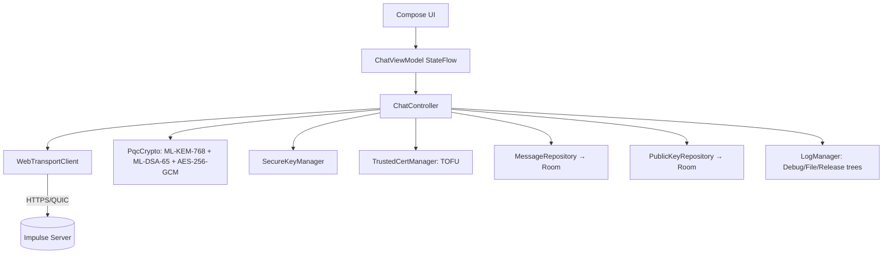

<div align="center">

[🇺🇸 **English**](README.md) | [🇷🇺 Русский](README.ru.md)


[](https://kotlinlang.org)
[](https://www.android.com)
[](LICENSE)
[](https://developer.android.com/reference/android/net/http/WebTransport)
[](https://en.wikipedia.org/wiki/ML-KEM)
[](https://github.com/Oqune/Impulse-client/releases)

Минимальный, самостоятельно развёртываемый, **постквантовый сквозь-шифрованный** LAN-клиент чата для Android.
Работает в паре с [сервером Impulse](https://github.com/Oqune/Impulse-server/).

</div>

## Возможности

- 🚀 **WebTransport**-транспорт (Android 9+), полностью заменяющий WebSocket.
- 🔐 **Постквантовое E2EE**: Per-Recipient KEM Wrapping — каждое сообщение
  шифруется отдельно для каждого получателя через **ML-KEM-768**,
  шифруется **AES-256-GCM** и подписывается **ML-DSA-65 (Dilithium3)**.
- 📷 **Привязка сертификата (TOFU)** через QR-скан (`impulse-cert:<sha256>`),
  в зашифрованном `SecureStorage` (Android Keystore + AES-256-GCM); хранятся
  до двух хешей (текущий + следующий) для плавной ротации.
- 🗄️ **Зашифрованная история** (Room): каждое тело сообщения шифруется
  AES-256-GCM перед записью; автоочистка по **TTL 72 часа**.
- 📱 Jetpack Compose (Material 3); авто-reconnect с экспоненциальной задержкой;
  foreground-сервис; переподключение после перезагрузки.
- 🔑 **Экспорт/импорт ключей** (PBKDF2 + AES-256-GCM) для переноса ML-KEM
  идентичности между устройствами (новый ML-DSA ключ генерируется при импорте).
- 🌗 Светлая / тёмная / системная темы и опциональная биометрическая блокировка.

## Бинарный протокол (опкоды `0x01`–`0x0C`)

Каждый кадр начинается с одного байта опкода. Кодирование полей — little-endian:
`u8` (1 Б), `u32` (4 Б префикс длины), `u64` (8 Б), `bytes` (`u32` длина + raw).
Сервер никогда не видит метаданные plaintext — отправитель, подпись и
содержимое живут внутри AES-256-GCM `OP_DATA` payload.

| Опкод | Имя | Направление | Тело |
|-------|-----|-------------|------|
| `0x01` | `OP_AUTH` | C→S | `[u32 LE pwd_len][raw pwd bytes][32 raw HMAC bytes]` |
| `0x02` | `OP_AUTH_RESULT` | S→C | `success(u8)` [error utf8 если !success] |
| `0x03` | `OP_SYNC` | C→S | `last_seen_id(u64)` |
| `0x04` | `OP_SYNC_RESPONSE` | S→C | `count(u32)` { `id(u64)`, `timestamp(u64)`, `len(u32)`, `payload(bytes)` } |
| `0x05` | `OP_DATA` | обе | C→S: `len(u32)`+`payload`. S→C relay: `server_msg_id(u64)`+`timestamp(u64)`+`len(u32)`+`payload` |
| `0x06` | `OP_HEARTBEAT` | обе | `client_timestamp(u64)` |
| `0x07` | `OP_NEW_CERT_HASH` | S→C | `hash(32 байта raw)` + `expiry(u64)` (без префикса длины) |
| `0x08` | `OP_DISCONNECT` | обе | без payload |
| `0x0B` | `OP_AUTH_CHALLENGE` | S→C | `[16-byte nonce][u32 salt_len][B64 Argon2id salt]` |
| `0x0C` | `OP_KEY_EXCHANGE_KEM_DSA` | обе | `kem_key_len(u32)`+`ML-KEM-768 публичный ключ` + `dsa_key_len(u32)`+`ML-DSA-65 публичный ключ` (комбинированный, ретранслируется атомарно) |

Опкоды `0x09`–`0x0A` зарезервированы/не используются. Авторитетный список —
константы `OP_*` в `transport/Protocol.kt` и enum `Opcode` в серверном
`src/protocol.rs`; они ДОЛЖНЫ оставаться синхронизированными.

Клиент хранит авторитетную строку по реальному `server_msg_id`; собственная
оптимистичная копия использует **отрицательный** временный id, чтобы не конфликтовать.

## Аутентификация

Challenge-response на базе Argon2id + HMAC-SHA-256. Сервер хранит только Argon2id-хеш
пароля (никогда — plaintext). Поток:

1. Сервер шлёт `OP_AUTH_CHALLENGE` (0x0B): 16-байтный nonce + Argon2id salt.
2. Клиент вычисляет `key = Argon2id(salt, password)`, затем `HMAC-SHA-256(key, nonce)`.
3. Клиент шлёт `OP_AUTH` (0x01): `[pwd_len][raw pwd bytes][32 raw HMAC]`.
4. Сервер проверяет HMAC и отвечает `OP_AUTH_RESULT` (0x02).

Сгенерируйте хеш сервера через `impulse-server --hash-password <pw>` и передайте
его в `config.toml` (`password_hash`) или через `--password-hash`.

В приложении: **Настройки → Настройки сервера** → встроенный сервер *Production*
(тот же пароль) или кастомный сервер (IP, порт, пароль).

## Требования и сборка

- **Android 9 (API 28)**+ устройство/эмулятор.
- Android Studio (AGP 8.13+), **JDK 17**, Android SDK 34+.
- Сервер с **WebTransport** поверх HTTPS/QUIC на заданных host:port.

```bash
git clone https://github.com/Oqune/Impulse-client.git
cd Impulse-client
./gradlew assembleDebug        # или откройте в Android Studio и Run 'app'
```

Установите APK из `app/build/outputs/apk/debug/` (API 28+). Камера запрашивается
при первом QR-скане. Подписанные release-сборки используют локальный
`keystore/impulse-release.jks` (см. `docs/policies/release.md`).

## Первый запуск

1. Откройте приложение → **Home** → нажмите **Connect**.
2. Без закреплённого сертификата состояние становится *Ошибка / нужен QR*.
3. Откройте вкладку **QR** и отсканируйте серверный QR (`impulse-cert:<64-hex-sha256>`).
   Принимается только строгий payload `impulse-cert:<64 hex>`.
4. Сервер может прислать *следующий* хеш сертификата (`OP_NEW_CERT_HASH`) для ротации.
5. Публичные ключи ML-KEM-768 + ML-DSA-65 обмениваются атомарно через
   `OP_KEY_EXCHANGE_KEM_DSA` (0x0C); когда ключи пиров закешированы — канал `READY`.
6. **Аутентификация автоматическая** при подключении: сервер шлёт `OP_AUTH_CHALLENGE`,
   клиент отвечает `OP_AUTH`, и по `OP_AUTH_RESULT` (0x02) в течение 15 с канал
   становится `AUTHENTICATED → READY`. Отправка блокируется до `READY`.

## Заметки по реализации

- **PQC** (ML-KEM-768 + ML-DSA-65) — из BouncyCastle (`bcprov-jdk18on`);
  на Android ART доступно только через выделенный `BouncyCastlePQCProvider`.
  См. `security/PqcCrypto.kt`.
- **Per-Recipient KEM Wrapping**: каждое сообщение шифруется N раз (по получателю)
  через ML-KEM-768; сервер только ретранслирует opaque bytes. Публичные ключи
  пиров кешируются в Room с TTL 72 часа.
- **Безопасное хранилище** — самостоятельный `SecureStorage.kt` на Android Keystore +
  AES-256-GCM (без зависимостей Tink/Gson).
- **WebTransport**-символы (`android.net.http.*`, API 28+) предоставляются на этапе
  компиляции локальным stub JAR (`app/libs/android-net-http-stub.jar`, `compileOnly`);
  реализация в рантайме — из фреймворка устройства.
- **16 KB page-size (Android 15+)**: сборка переписывает нативные `.so` в APK на
  16 KB ELF-выравнивание (`app/scripts/align16kb.py`), чтобы APK грузился на
  Android 15+. ABI `x86` включён для эмуляторов; QUIC там деградирует (нет x86 native lib) по дизайну.

## Архитектура



Конечный автомат соединения: `DISCONNECTED → CONNECTING → CONNECTED →
AUTHENTICATING → AUTHENTICATED → READY`; сбои уходят в `ERROR` с авто-reconnect.

## Тестирование

```bash
./gradlew test            # unit: PqcCrypto, Protocol, SecureKeyManager, PerRecipientPacket
./gradlew connectedAndroidTest   # instrumented: TrustedCertManager (TOFU), MessageDao (Room, TTL)
```

Покрытие: ML-KEM/ML-DSA round-trips, отклонение подтасовок, TOFU-pinning,
build/parse Per-Recipient blob, полный цикл протокола без сети.

## Лицензия

MIT — см. [LICENSE](LICENSE). Клиент и сервер предназначены для совместного использования.
