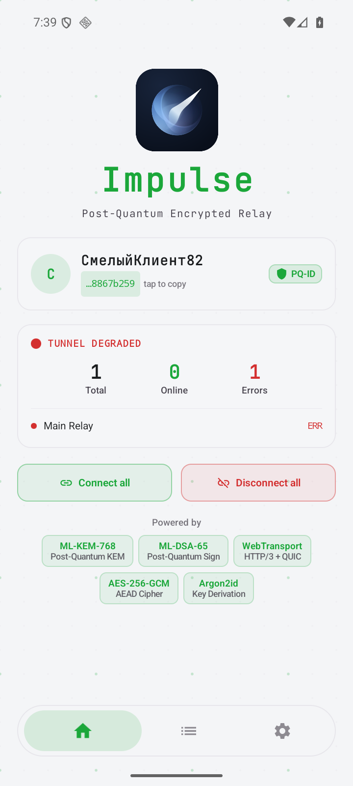
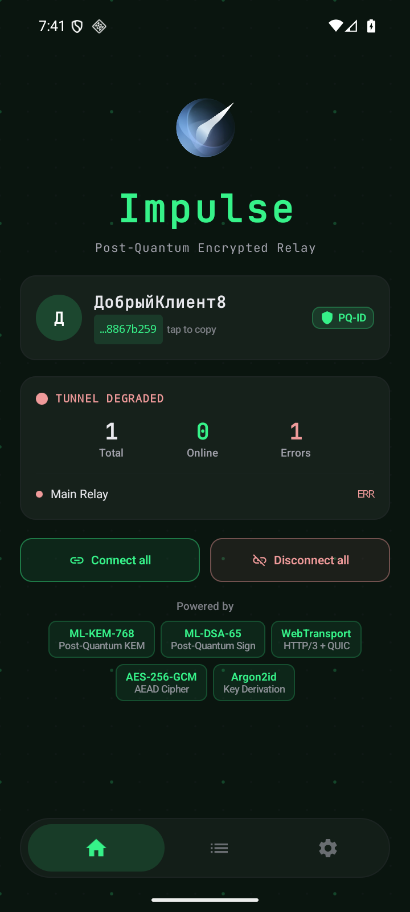
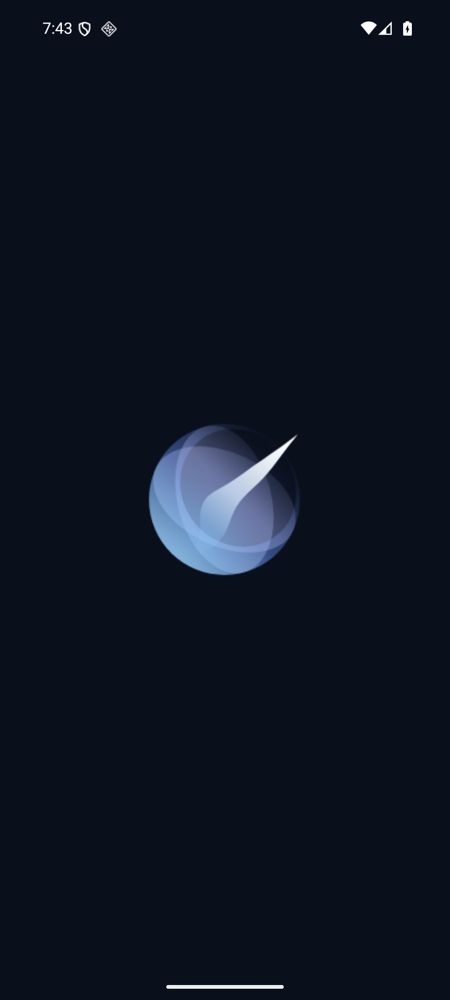

# Identity V18 — живая проверка Android и статус GitHub

Дата: 2026-10-09. Проверен опубликованный debug APK из ветки `feat/brand-identity-v18` на отдельном пустом AVD `Impulse_API_36` (Google APIs, Android 16 / API 36, x86_64, профиль Pixel 7). Настройки реального телефона не затрагивались.

## Android

- Установка и холодный запуск проходят; новая иконка видна в launcher, нативный VectorDrawable отображается на системной заставке.
- На Home знак виден в светлой теме с графитовой рамкой и в тёмной теме с прозрачной подложкой. Расчётный размер 96 dp сохранён, элементы не перекрывают карточки и навигацию. Динамический зелёный цвет UI сохранён.
- Навигация Settings / App и прокрутка настроек работают. Для снимков использован существующий переключатель Allow screenshots и его диалог согласия только в тестовом AVD. После проверки переключатель выключен; область приложения на контрольном снимке полностью чёрная, системные панели остаются видимыми.
- После первоначальной задержки System UI уменьшена физическая плотность/разрешение гостя до 720×1600 / 280 dpi при той же логической ширине. Это устранило зависание окружения. После проверки восстановлены разрешение, плотность и масштабы анимации, эмулятор выключен.

Ограничения: тестовый relay не настроен, поэтому Home показывает Main Relay ERR. Полная отправка сообщений с Android, реальные телефоны, другие версии Android и themed icon в launcher этим smoke check не проверялись. Отдельный server loopback-тест QUIC/pinning/auth/relay/sync ранее прошёл.

## GitHub

- [Client PR #1](https://github.com/Oqune/Impulse-client/pull/1): код `54c5785`, build/test и сборка release APK успешно прошли в [run 37827161094](https://github.com/Oqune/Impulse-client/actions/runs/37827161094).
- [Server PR #2](https://github.com/Oqune/Impulse-server/pull/2): код `e995dd0`, tests и все шесть Linux/Windows architecture builds успешно прошли в [run 37811580548](https://github.com/Oqune/Impulse-server/actions/runs/37811580548).
- Обе ветки опубликованы; PR открыты. README-шапки, SVG-исходники, платформенные иконки и social cards входят в PR. `master` ещё не обновлён; релиз не выпускался. Изображения social preview в настройках репозиториев ещё не установлены.

Дополнение обновляет результаты проверки; исполняемый код после указанных успешных CI runs не менялся.

## Снимки тестового AVD

